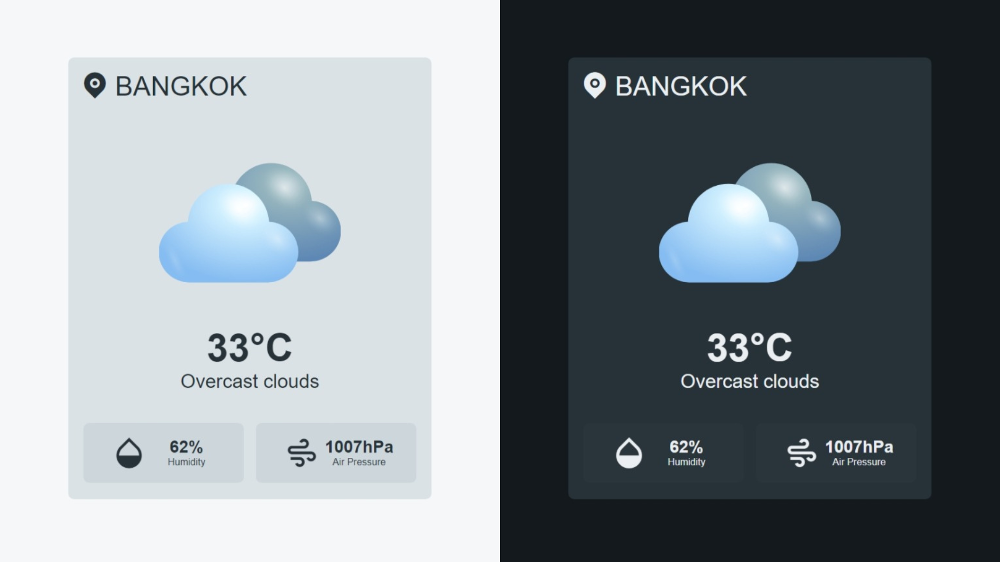

# Weather App (HTML,CSS,JavaScript)

This Weather App has been developed using HTML, CSS, and Vanilla JavaScript.

## Features
- Show weather by searching.
- Switch the theme from light to dark (or dark to light).

## Warning!

Please insert your API key from [Open Weather](https://openweathermap.org/api) in "js > script.js > line 2."

       const apiKey = 'YOUR_API_KEY';

## Preview

## Credit
Weather API: [Open Weather](https://openweathermap.org/api) 
Weather Icon: [Freepik @coolvector](https://www.freepik.com/free-vector/gradients-weather-icons-apps_15292633.htm) 
Error Icon: [Freepik @kupixels](https://www.freepik.com/free-psd/3d-web-error_28631339.htm) 
Icon: [Remix Icon](https://remixicon.com/) 

